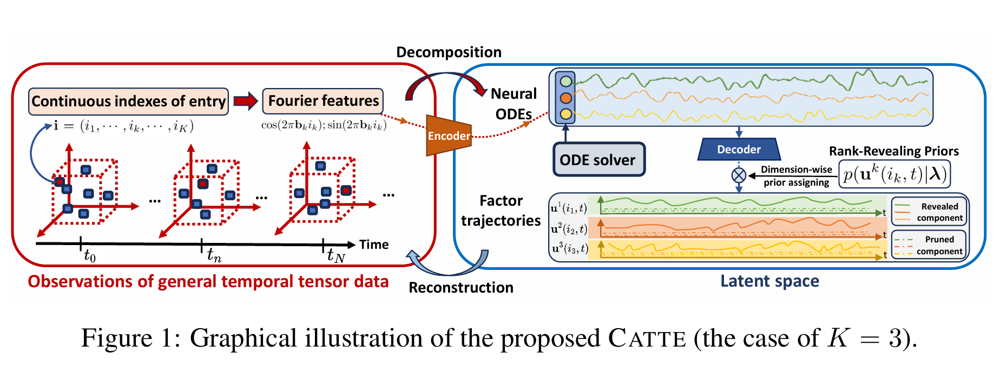
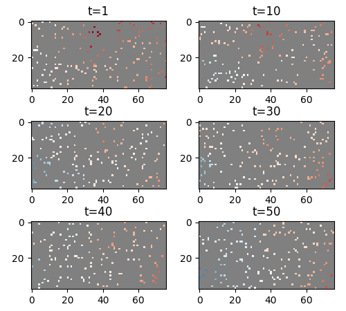
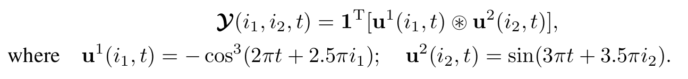
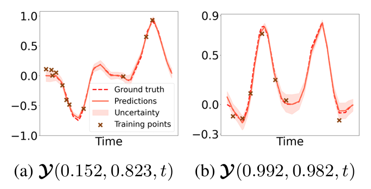
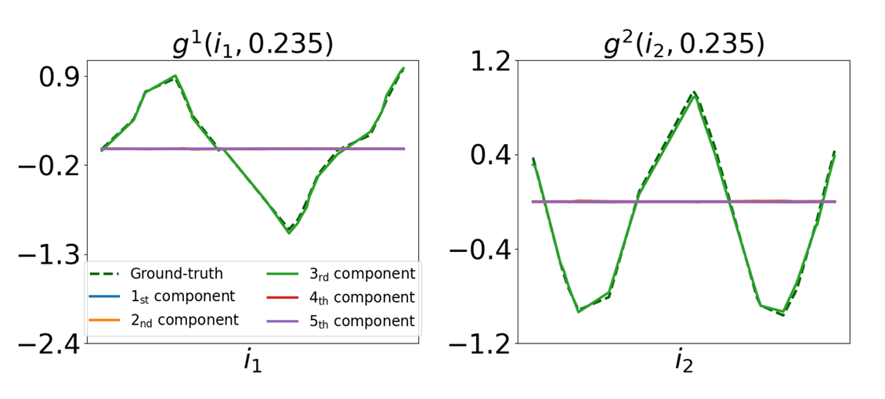

#  😸CATTE:Functional Complexity-adaptive Temporal Tensor Decomposition
<div align=center>  </div>
(This repo is still on update)

This is authors' official PyTorch implementation for paper:"**Functional Complexity-adaptive Temporal Tensor Decomposition**"[[Arxiv](https://arxiv.org/abs/2502.06164)].


---
## Key Idea
Functional temporal tensor decomposition leveraging implicit neural representations for the spatial mode and neural ODEs for the temporal mode + automatic functional rank determination (FARD).


<!-- <!-- <div align=center>  </div> -->

<div align=center>  </div>


---

## Quick Snapshot of  Results on Sound Speed Field dataset: 
### Sampling Pattern with 5% Observation Rate:

<div align=center>  </div>

#### Reconstruction Results: 
<table align="center">
  <tr>
  <td align="center">
    <br>
    <sub>A: Ground Truth</sub>
  </td>
  <td align="center">
    <br>
    <sub>B: Reconstruction Results with 5% Observation Rate</sub>
  </td>
</tr>
</table>


Through capturing the spatiotemporal continuity property  of the real-world data and employing the FARD mechanism to automatically determine model complexity, ***CATTE achieves accurate and smooth reconstructions from sparse observations—without the need for pre-training on large datasets.***

----------------------
### Functional Automatic Rank Determination Mechanism:

- We test the FARD on synthetic data. We generated a two-mode temporal tensor (the underlying rank is 1), and each entry is defined as:
<div align=center>  </div>

- The reconstruction results are:
<div align=center>  </div>
We showed the predictive trajectories of entry value indexed in different coordinates. The dotted line represents the ground truth and the full line represents the the predic
tive mean learned by our model. The cross symbols represent the training points. The shaded region  resents the predictive uncertainty region. One can see that although the training points are sparse and noisy, CATTE accurately recovered the ground truth, demonstrating that it has effectively captured the temporal dynamics.

- We then show the learn rank:
<div align=center>  </div>
One can see that CATTE identifies the underlying rank (i.e., 1) through uniquely
recovering the real mode functions and other four components are learned to be zero. More detailed interpretations on the rank revealing process can be reffered to the preprint.


------------------

<!-- Example of latent functions of spatial and temporal modes learned from real-world data.
<div align=center>  </div>
<div align=center>  </div> -->

## Requirements:
The project is mainly built with **pytorch 2.3.0** under **python 3.10**. The detailed package info can be found in `requirement.txt`.

## Instructions:
1. Clone this repository.
<!-- 2. To play with the model quickly, we offer several notebooks at `notebook`(on activate matter data)
3. The project primarily consists of three `.py` files, **which should be executed in the following order:** 

- **`train_FTM.py`**  
  Trains the Functional Tucker Model using physical data and outputs shared latent functions along with batches of core tensors.

- **`train_GPSD.py`**  
  Trains the GP-based Sequential Diffusion Model using the batches of core tensors obtained from the first step.

- **`message_passing_DPS.py`**  
  Reconstructs the entire field from sparse observations using our proposed Message-Passing DPS algorithm.


4. Tune the (hyper)parameters of model in the corresponding `.py` file.
5. To apply the model on your own dataset, please follow the  `preprocessing_data.py` file to process the raw data into appropriate format.
6. GPU choice: the models are run on CPU by default, but you can change the device to CPU by modifying the `device` in the correponding file
 -->

<!-- ## Data

We offer the **raw data**,  **processed data** and **processed scripts** for all three datasets used in paper. Given the large size of  *Solar-Power* and *Uber-Move*, we put them in the [google drive](https://drive.google.com/drive/folders/1KtxKwGaUAFnKWXwjUzjZ64hmYlda2Qtl?usp=sharing).

- Traffic-Guangzhou: [raw data](https://github.com/xuangu-fang/BayOTIDE/blob/master/data/raw/tensor.mat), [processed scripts](https://github.com/xuangu-fang/BayOTIDE/blob/master/data/process_script/data_process_guangzhou.ipynb), and [processed data](https://github.com/xuangu-fang/BayOTIDE/tree/master/data/guangzhou) 

- Solar-Power: [raw data](https://drive.google.com/drive/folders/1KtxKwGaUAFnKWXwjUzjZ64hmYlda2Qtl?usp=sharing), [processed scripts](https://github.com/xuangu-fang/BayOTIDE/blob/master/data/process_script/data_process_solor.ipynb), and [processed data](https://drive.google.com/drive/folders/1KtxKwGaUAFnKWXwjUzjZ64hmYlda2Qtl?usp=sharing) 

- Uber-Move: [raw data](https://drive.google.com/drive/folders/1KtxKwGaUAFnKWXwjUzjZ64hmYlda2Qtl?usp=sharing), [processed scripts](https://github.com/xuangu-fang/BayOTIDE/blob/master/data/process_script/data_process_uber.ipynb), and [processed data](https://drive.google.com/drive/folders/1KtxKwGaUAFnKWXwjUzjZ64hmYlda2Qtl?usp=sharing) 


The code for generating the synthetic data is also provided in the [notebook]( https://github.com/xuangu-fang/BayOTIDE/blob/master/data/process_script/gen_simu.ipynb).


If you wanna customize your own data to play the model, please follow the notebooks in `data/process_script/`. -->


## Citing 😸CATTE 
> 😺 If you find this resource helpful, please consider to star this repository and cite our research:
```tex
@misc{chen2025catte,
      title={Functional Complexity-adaptive Temporal Tensor Decomposition}, 
      author={Panqi Chen and Lei Cheng and Jianlong Li and Weichang Li and Weiqing Liu and Jiang Bian and Shikai Fang},
      year={2025},
      eprint={2502.06164},
      archivePrefix={arXiv},
      primaryClass={cs.LG},
      url={https://arxiv.org/abs/2502.06164}, 
}
```
In case of any questions, bugs, suggestions or improvements, please feel free to open an issue.